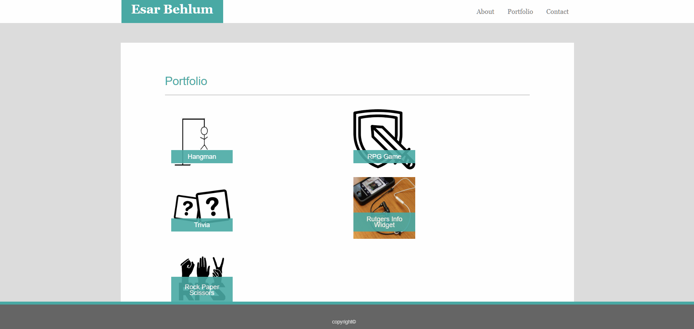

# Bootstrap-Portfolio

About Me:

Portfolio:

Contact:

Making a portfolio made out of Bootstrap elements, positioning, and styling alongside a bit of css.

## Getting Started

The Portfolio starts with the index.html, which is the main About Me content. In the nav on the top right, there are hyperlinks relaying to the Portfolio itself as well as the Contact page.

You will need all of the files in this repository (except git) for it all to work properly.

### Prerequisites

If you are running it on a server, a preferred apache2, nginx, or express webserver is required to host the html files.

There are no software prerequisites if running locally on your pc. An internet connection may be required to load Bootstrap elements correctly.

### Installing

To run on both localhost pc server or a remote server, download all folders and files, exluding the git images folder. Once all of these are in a single dedicated folder, you are all set.

## Deployment
If hosting on a remote server, placing the html files and folders in your web directory is the only step required. 

If local, open the index.html file with your preferred browser. That's all there is to it!

## Built With

* HTML - The web framework used
* CSS - Dependency Management
* [Bootstrap](https://bootstrap.com/) - Used to generate RSS Feeds

## Authors

* **Esar Behlum** 

